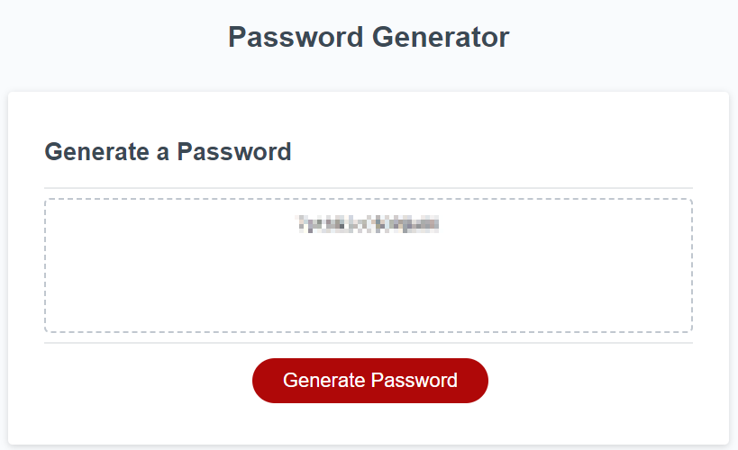

# Password Generator
---

## Site Description

This site presents an application that enables users to generate random passwords based on their chosen criteria to create strong passwords that provide greater account security. This app runs in the browser and features dynamically updated HTML and CSS powered by JavaScript code. It is a responsive user interface that adapts to multiple screen sizes.

---

## Usage

When a use clicks "Generate Password," they are first prompted to provide a password length between 8 and 128 characters. They are then asked - in succession - if they would like to use lowercase letters, uppercase letters, numbers, and/or special characters. Users have the option to accept or reject each parameter by clicking OK or Cancel, respectively. When all prompts have been answered, the user's new secure password will be presented to them on the page. 

---

## Screenshots

**Landing page**  

**Question 1**  

**Question 2**  

**Question 3**  

**Question 4**  

**Question 5**  

**Result (Password redacted)**  

---

## Deployed Site

[Password Generator](https://ejseader.github.io/password-generator/)

---
